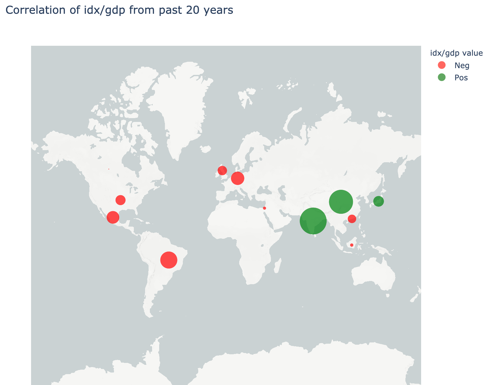

# Project 1: GDP & HDI vs Market Returns
* Problem: Is the Gross Domestic Product and the Human Development Index of a country a significant indicator of  stock market returns? 

## Please see following folders for corresponding notebooks, files and images:
**Notebooks Folder**
* Projectdata.ipynb : Data sourcing and clean up
* Visualization.ipynb: Visualization code and dashboard
* proposal_link : google docs link to original proposal

**Data and PNG folders**
* Contain Data csv files and PNG images of visualizations

**Presentation Project FinTech**
* Main presentation

---

## Interactive Map with General Data
* These maps visualize the correlation between the idx, gdp and hdi.
* The red and green bubbles represent the negative and positive correlations.
* The bubble size is based on the ranking of the idx/gdp and idx/hdi correlations.

---

## Time series analysis between GDP growth and Index returns
* The first Time series chart shows the GDP and Market Returns over the last 20 Years.(Drop down menu to filter by the country)
* The second chart shows all countries together for comparison.
* The third chart shows the GPD and Market Returns for all countries with a scale to choose the year.

---

## Correlations displayed independently, with other markets, and by location
* The Scatter plots the correlations. (Drop down menu to select correlations: idx/gdp, idx/hdi, gdp/hdi)
* The Heatmap illustrates the correlation matrix. (Drop down menu to filter by the geographical region)
* The Sunburts shows the map box visualizations and groups the correlation by positive/negative and further categorizes them by geographical regions.

---

## Time series analysis between Canadian GDP growth and TSX returns
* This Time series shows the correlation between the Canadian GDP and TSX over the last 30 years. (Drop down menu to filter by the decade)

---

